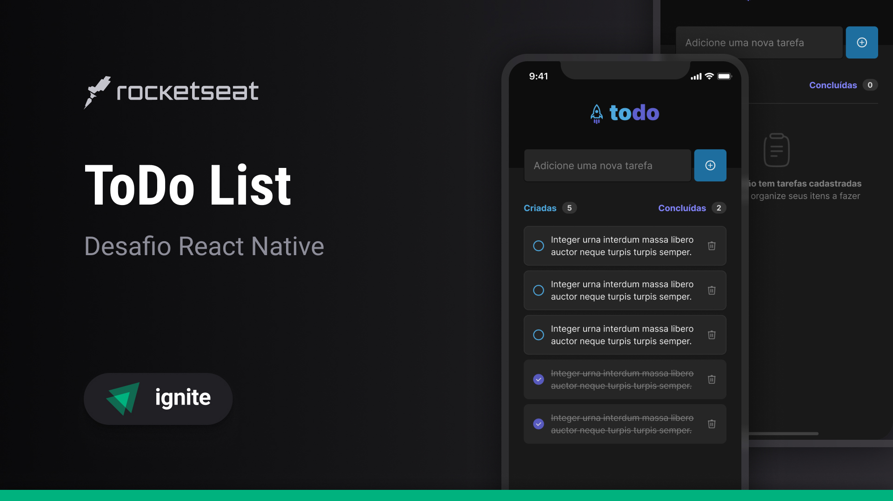

<h1 align="center"> toDo List </h1>

  <a href="#-tecnologias">Tecnologias</a>&nbsp;&nbsp;&nbsp;|&nbsp;&nbsp;&nbsp;
  <a href="#-projeto">Projeto</a>&nbsp;&nbsp;&nbsp;|&nbsp;&nbsp;&nbsp;
  <a href="#-layout">Layout</a>&nbsp;&nbsp;&nbsp;|&nbsp;&nbsp;&nbsp;
  <a href="#memo-licença">Licença</a>

  

 

  

## 🚀 Tecnologias

Esse projeto foi desenvolvido com as seguintes tecnologias:

- React Native
- Git e Github

## 💻 Projeto

O toDo List é um projeto de adição e remoção de tarefas.

## :memo: Licença

Esse projeto está sob a licença MIT.

---

Feito com ♥ by Lorenzo Matheo :wave: [Me siga no discord!](https://discord.gg/lorenzocamargo)
